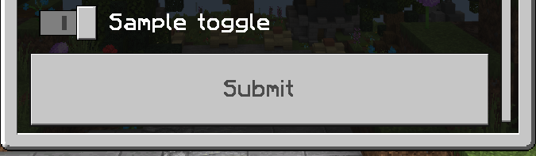

# libforms
A small form library built for PocketMine-MP

## Installation
This library can be installed using Composer:
```
composer require valiant-bedrock/libforms
```

## Usage

## Form Objects

### Buttons
A button is a clickable element that can be used in a `SimpleForm` or `ModalForm`. It consists of a text and a callback function called `onClick`.
The callback function looks like this: `function(Player $player): void {}`.
A simple button looks like this:
```php
new Button(
    text: "Example button",
    onClick: function(Player $sender): void { $sender->sendMessage("Secondary button clicked! "); }
)
```
The callback function signature looks like this: `function(Player $player): void {}`.
A simple button looks like this:
```php
new Button(
    text: "Example button",
    onClick: function(Player $player): void { $player->sendMessage("Secondary button clicked! "); }
)
```

### Elements
An element is a renderable object used in `CustomForm`.

The following elements are available:

#### `Dropdown`
This element allows the player to select one of the given options.

Here is a simple example of how that would look as a code snippet:
```php
new Dropdown(
    // The text to display next to the dropdown
    text: "Example dropdown",
    // The options to display in the dropdown
    options: ["First", "Second"],
    default: 1, // The index in the `options` (e.g. "Second")
    // The callback function called with the value when the player submits the form
    callable: function(string $value): void {
        // $value is the selected option (in this case, "First" or "Second") 
        var_dump("Dropdown value: $value");
    }
),
```

#### `Input`
This element allows the player to enter a string value.

Here is a simple example of how that would look as a code snippet:
```php
new Input(
    // The text to display next to the input
    text: "Sample input",
    // The value to display in the input field when the field is empty
    placeholder: "Placeholder text",
    // The value to display by default when the player opens the form
    default: "Default value",
    // The callback function called with the value when the player submits the form
    callable: function(string $value): void { var_dump("Input value: $value"); }
),
```

#### `Label`
This element displays text in the form. This element can not be modified by the player.

Here is a simple example of how that would look as a code snippet:
```php
new Label(
    // The text to display
    text: "Example label"
);
```

#### `Slider`
This element allows the player to select a value between a minimum and maximum value with an option of how much it should increase between each step.

Here is a simple example of how that would look as a code snippet:
```php
new Slider(
    // The text to display next to the slider
    text: "Example slider",
    // The minimum value of the slider
    min: 0,
    // The maximum value of the slider
    max: 10,
    // The amount of steps between the minimum and maximum value
    step: 1,
    // The default value of the slider
    default: 5,
    // The callback function called with the value when the player submits the form
    callable: function(int $value): void { var_dump("Slider value: $value"); }
),
```

#### `StepSlider`
This element follows similar principles to `Dropdown` of selecting an option, however, it resembles the look of a `Slider`.

Here is a simple example of how that would look as a code snippet:
```php
new StepSlider(
    text: "Example step slider",
    steps: ["First", "Second", "Third"],
    default: 0, // "First"
    callable: function(string $value): void { var_dump("Step slider value: $value"); }
),
```

#### `Toggle`
This element allows the player to select a value of either on or off (represented by a boolean in the library).

Here is a simple example of how that would look as a code snippet:
```php
new Toggle(
    text: "Example toggle",
    default: true,
    callable: function(bool $value): void { var_dump("Toggle value: " . var_export($value, true)); }
),
```

## Form Types
At the moment, there are three supported form types. These are listed below:

### `SimpleForm`
This form consists of a title, a string of text (also known as `content`), and a list of [buttons](#Buttons).

Here is a small example of how this could be implemented and its result:

#### Code snippet:

```php
new SimpleForm(
    title: "Simple Form",
    content: "This is a simple form's content.",
    buttons: [
        new Button(
            text: "Button 1",
            onClick: function(Player $player): void { $player->sendMessage("First button clicked! "); }
        ),
        new Button(
            text: "Button 2",
            onClick: function(Player $player): void { $player->sendMessage("Second button clicked! "); }
        ),
    ],
    // This is called when the form is closed.
    onClose: function(Player $player): void { $player->sendMessage("Simple form was closed!"); }
)
```
#### Result


#### Output (If the player clicks the first button)


### `CustomForm`
This form is composed of a title, a list of [elements](#Elements) and a client-sided submit button.

Here is a small example of how this could be implemented and its result:

#### Code snippet:

```php
// NOTE: $player is a `Player` object.

new CustomForm(
    title: "Custom Form",
    elements: [
        new Dropdown(
            text: "Sample dropdown",
            options: ["Option 1", "Option 2", "Option 3"],
            default: 0, // "Option 1"
            callable: function(string $value) use ($player): void { $player->sendMessage("Dropdown value: $value"); }
        ),
        new Input(
            text: "Sample input",
            placeholder: "Placeholder text",
            default: "Default value",
            callable: function(string $value) use ($player): void { $player->sendMessage("Input value: $value"); }
        ),
        new Label(text: "Sample label"),
        new Slider(
            text: "Sample slider",
            minimum: 0,
            maximum: 100,
            step: 1,
            default: 50,
            callable: function(int|float $value) use ($player): void { $player->sendMessage("Slider value: $value"); }
        ),
        new StepSlider(
            text: "Sample step slider",
            steps: ["Step 1", "Step 2", "Step 3"],
            default: 2, // "Step 3"
            callable: function(string $value) use ($player): void { $player->sendMessage("Step slider value: $value"); }
        ),
        new Toggle(
            text: "Sample toggle",
            default: true,
            callable: function(bool $value) use ($player): void { $player->sendMessage("Toggle value: " . var_export($value, true)); }
        )
    ]
)
```

#### Result



#### Output (With modified data)


### `ModalForm`
Similar to `SimpleForm`, this form contains a title, two [buttons](#Buttons) and a string of text.
One major difference between the two is that the `ModalForm` is laid out in a way that presents the
string of text as the main content of the form. This is useful for forms that want to ensure a user's selection (Yes/No, Submit/Cancel, etc.)
Here is a small example of how this could be implemented and its result:

#### Code snippet:
```php
new ModalForm(
    title: "Modal Form",
    content: "This is a modal form's content.",
    primaryButton: new Button(
        text: "Primary button",
        onClick: function(Player $player): void { $player->sendMessage("Primary button clicked! "); }
    ),
    secondaryButton: new Button(
        text: "Secondary button",
        onClick: function(Player $player): void { $player->sendMessage("Secondary button clicked! "); }
    ),
    onClose: function(Player $player): void { $player->sendMessage("Modal form was closed!"); }
),
```

#### Result


#### Output (If the player clicks the secondary button)


## Issues / Suggestions
Any issues or suggestions with the library can be reported [here](https://github.com/Valiant-Bedrock/libforms/issues).